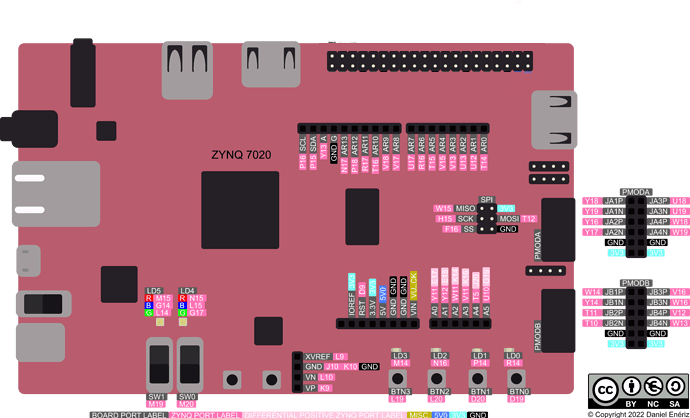
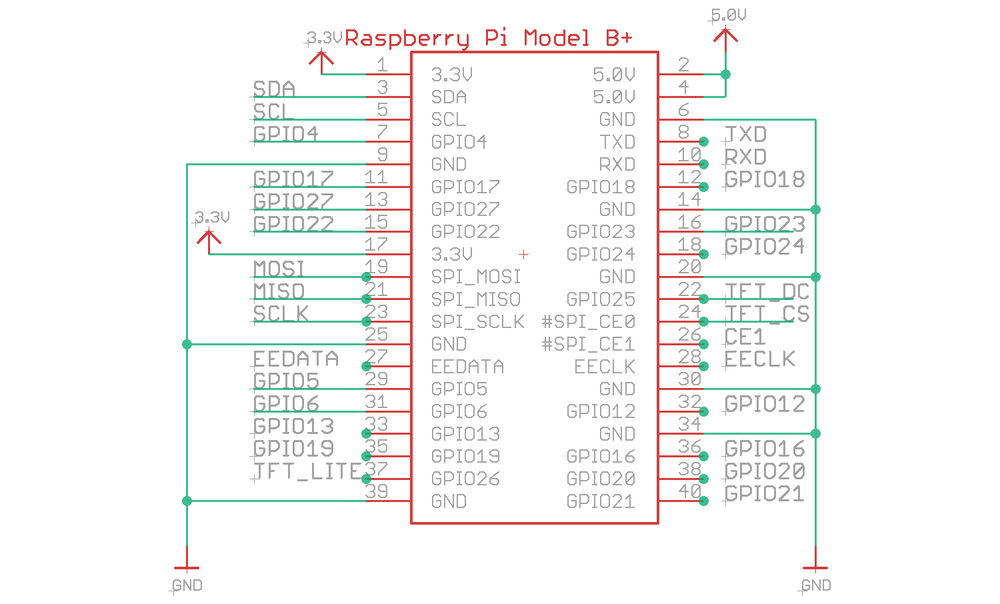
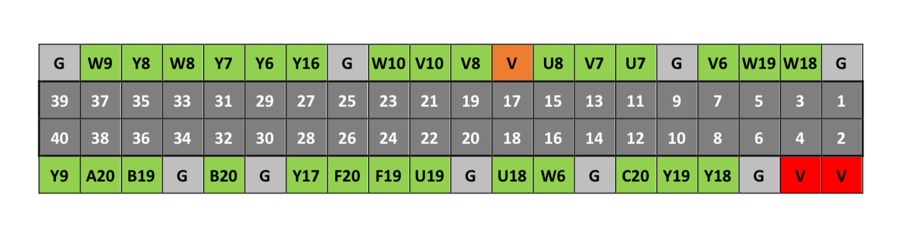

# DOOM Port for X-HEEP

This folder contains a port of the classic DOOM game for the X-HEEP platform. The implementation targets X-HEEP prototyped on the PYNQ-Z2 FPGA and interfaces with external peripherals such as:

- **Adafruit Bonnet** (for joystick/button input and TFT display output)
- **EPFL Programmer** (for the external flash)

## Hardware Wiring

| **Description**     | **PYNQ-Z2 PIN** | **ADAFRUIT PIN** | **Software PIN**  |
|---------------------|-----------------|------------------|-------------------|
| Joystick UP         | U8              | GPIO17           | GPIO 10           |
| Joystick DOWN       | V7              | GPIO22           | GPIO 11           |
| Joystick LEFT       | U7              | GPIO27           | GPIO 12           |
| Joystick RIGHT      | V6              | GPIO23           | GPIO 13           |
| Button A            | AR2             | GPIO6            | GPIO 14           |
| Button B            | AR3             | GPIO5            | GPIO 9            |
| Display CLK         | H15             | SCLK             | `spi_sck.o`       |
| Display MOSI        | T12             | MOSI             | `spi_sd.io[0]`    |
| Display CS          | F16             | TFT_CS           | `spi_csb.o`       |
| Display DC          | V8              | TFT_DC           | GPIO 8            |
| Display Backlight   | 5V              | TFT_LITE         |                   |
| Display Power       | 3.3V            | 3.3V             |                   |
| Ground              | GND             | GND              |                   |







## Build and Flash Instructions

**Important:** If this is your first time programming the flash, set `generate_to_flash` to `true` in `r_data.c` to generate and store textures in flash. After this step is completed once, set it back to `false` to skip regeneration (which is slow).

### 1. Compile the Application

The application must be compiled using flash load mode. To build for the PYNQ-Z2 FPGA, run:

```bash
make app PROJECT=0_DOOM TARGET=pynq-z2 LINKER=flash_load
```

### 2. Programming the Flash

#### First-Time Setup

If this is the first time you are programming the flash, you need to program DOOM's WAD file into external flash. Run:

```bash
make flash-prog-doom
```

#### Subsequent Runs

If the WAD is already programmed, use the regular flash programming command:

```bash
make flash-prog
```

### 3. Programming the PYNQ-Z2 Board

To load the bitstream onto the PYNQ-Z2 FPGA, run:

```bash
make vivado-fpga-pgm FPGA_BOARD=pynq-z2
```

## Changing Levels without using the menu

If you prefer to skip the in-game menu and load a specific level directly, you can modify the game startup behavior in the source code.

To do this, open `d_doomTop.c` and ensure that `DEBUG_SETUP` is defined and set to `1`. Then locate the `D_DoomLoop()` function, where you'll find the following code block:

```c
#if DEBUG_SETUP
    if (!startedGame)
    {
        startedGame = true;
        G_DeferedInitNew(sk_medium, 1, 1);
        //D_AdvanceDemo(); 
    }
#endif
```

### Configuration Options

- **To launch the demo:** Uncomment `D_AdvanceDemo()` and comment out `G_DeferedInitNew()`
- **To launch a specific level:** Modify the third parameter of `G_DeferedInitNew()` to any number between 1 and 9
  - Example: To load level 2, call `G_DeferedInitNew(sk_medium, 1, 2);`
- **To change difficulty:** Modify the first parameter of `G_DeferedInitNew()` to one of:
  - `sk_baby` (I'm too young to die)
  - `sk_easy` (Hey, not too rough)
  - `sk_medium` (Hurt me plenty)
  - `sk_hard` (Ultra-Violence)
  - `sk_nightmare` (Nightmare!)
